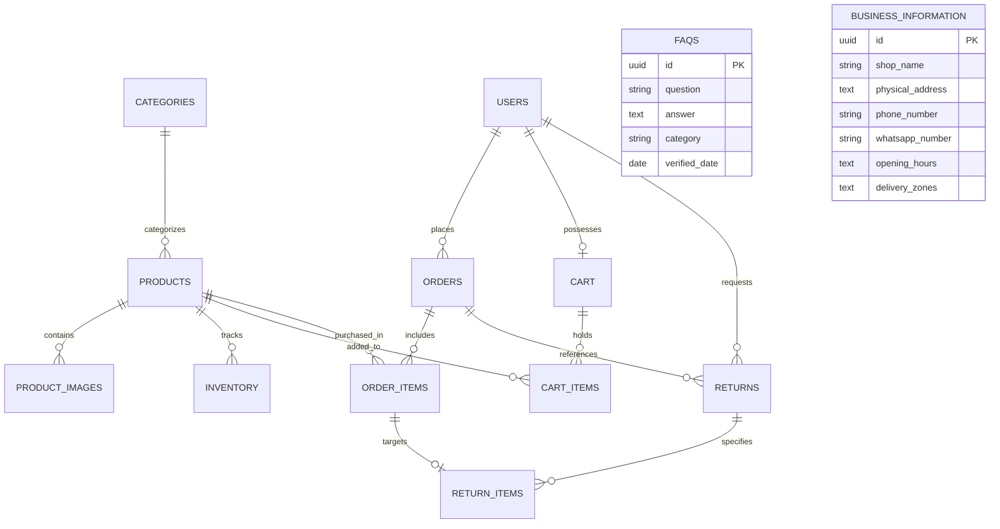

# Database Schema: Rainbow Ready Mades

> **Status:** Planned / Target Relational Design  
> **Target Database:** PostgreSQL (Target) / SQLite (Local Development)  
> **ORM Framework:** SQLAlchemy 2.0 (Declarative Models)  

---

## 1. Entity-Relationship Diagram (ERD)

---

## 2. Table Specifications

### 2.1 `users`
Stores customer accounts and store administrative credentials.
* `id` (UUID / Integer, Primary Key)
* `full_name` (VARCHAR(120), NOT NULL)
* `email` (VARCHAR(255), UNIQUE, NOT NULL, Indexed)
* `hashed_password` (VARCHAR(255), NOT NULL)
* `phone_number` (VARCHAR(20), NULL)
* `role` (VARCHAR(20), DEFAULT `'CUSTOMER'`) — Values: `'CUSTOMER'`, `'ADMIN'`
* `created_at` (TIMESTAMP, DEFAULT NOW())

### 2.2 `categories`
Hierarchical or flat classification of apparel.
* `id` (VARCHAR(50), Primary Key) — e.g. `'womens-ethnic'`, `'mens-casual'`
* `name` (VARCHAR(100), NOT NULL)
* `description` (TEXT, NULL)
* `is_active` (BOOLEAN, DEFAULT TRUE)

### 2.3 `products`
Master catalog items representing real garments in Rainbow Ready Mades.
* `id` (VARCHAR(50), Primary Key) — e.g. `'prod_001'`
* `category_id` (VARCHAR(50), Foreign Key $\rightarrow$ `categories.id`)
* `title` (VARCHAR(200), NOT NULL)
* `description` (TEXT, NOT NULL)
* `price` (DECIMAL(10, 2), NOT NULL)
* `discount_price` (DECIMAL(10, 2), NULL)
* `material` (VARCHAR(100), NOT NULL) — e.g. `'100% Breathable Cotton'`
* `care_instructions` (TEXT, NULL)
* `is_featured` (BOOLEAN, DEFAULT FALSE)
* `created_at` (TIMESTAMP, DEFAULT NOW())

### 2.4 `product_images`
Product photo gallery paths.
* `id` (UUID, Primary Key)
* `product_id` (VARCHAR(50), Foreign Key $\rightarrow$ `products.id`, ON DELETE CASCADE)
* `image_url` (VARCHAR(500), NOT NULL) — Path relative to `/assets/products/`
* `is_primary` (BOOLEAN, DEFAULT FALSE)
* `display_order` (INTEGER, DEFAULT 0)

### 2.5 `inventory`
Variant level stock tracking by Size and Color.
* `id` (UUID, Primary Key)
* `product_id` (VARCHAR(50), Foreign Key $\rightarrow$ `products.id`, ON DELETE CASCADE)
* `size` (VARCHAR(20), NOT NULL) — e.g. `'S'`, `'M'`, `'L'`, `'XL'`, `'38'`, `'42'`
* `color` (VARCHAR(50), NOT NULL) — e.g. `'Indigo Blue'`, `'Maroon'`
* `stock_quantity` (INTEGER, DEFAULT 0, CHECK stock_quantity >= 0)

### 2.6 `cart` & `cart_items`
Shopping basket persistence.
* **`cart`:**
  * `id` (UUID, Primary Key)
  * `user_id` (UUID / Integer, Foreign Key $\rightarrow$ `users.id`, NULL for guest sessions)
  * `created_at` (TIMESTAMP, DEFAULT NOW())
* **`cart_items`:**
  * `id` (UUID, Primary Key)
  * `cart_id` (UUID, Foreign Key $\rightarrow$ `cart.id`, ON DELETE CASCADE)
  * `product_id` (VARCHAR(50), Foreign Key $\rightarrow$ `products.id`)
  * `size` (VARCHAR(20), NOT NULL)
  * `color` (VARCHAR(50), NOT NULL)
  * `quantity` (INTEGER, DEFAULT 1)
  * `unit_price` (DECIMAL(10, 2), NOT NULL)

### 2.7 `orders` & `order_items`
Order transaction records and fulfillment tracking.
* **`orders`:**
  * `id` (VARCHAR(50), Primary Key) — e.g. `'ord_8841'`
  * `user_id` (UUID / Integer, Foreign Key $\rightarrow$ `users.id`)
  * `tracking_code` (VARCHAR(50), UNIQUE, NOT NULL) — e.g. `'RRM-TRK-8841'`
  * `status` (VARCHAR(30), DEFAULT `'PLACED'`) — Enum: `'PLACED'`, `'PROCESSING'`, `'DISPATCHED'`, `'DELIVERED'`, `'CANCELLED'`
  * `total_amount` (DECIMAL(10, 2), NOT NULL)
  * `payment_method` (VARCHAR(30), DEFAULT `'CASH_ON_DELIVERY'`)
  * `shipping_address` (TEXT, NOT NULL)
  * `customer_phone` (VARCHAR(20), NOT NULL)
  * `created_at` (TIMESTAMP, DEFAULT NOW())
* **`order_items`:**
  * `id` (UUID, Primary Key)
  * `order_id` (VARCHAR(50), Foreign Key $\rightarrow$ `orders.id`, ON DELETE CASCADE)
  * `product_id` (VARCHAR(50), Foreign Key $\rightarrow$ `products.id`)
  * `size` (VARCHAR(20), NOT NULL)
  * `color` (VARCHAR(50), NOT NULL)
  * `quantity` (INTEGER, NOT NULL)
  * `unit_price` (DECIMAL(10, 2), NOT NULL)

### 2.8 `returns` & `return_items`
Customer return and size exchange tracking.
* **`returns`:**
  * `id` (VARCHAR(50), Primary Key) — e.g. `'ret_502'`
  * `order_id` (VARCHAR(50), Foreign Key $\rightarrow$ `orders.id`)
  * `user_id` (UUID / Integer, Foreign Key $\rightarrow$ `users.id`)
  * `request_type` (VARCHAR(20), NOT NULL) — Values: `'RETURN'`, `'EXCHANGE'`
  * `status` (VARCHAR(30), DEFAULT `'SUBMITTED'`) — Values: `'SUBMITTED'`, `'APPROVED'`, `'REJECTED'`, `'COMPLETED'`
  * `admin_notes` (TEXT, NULL)
  * `created_at` (TIMESTAMP, DEFAULT NOW())
* **`return_items`:**
  * `id` (UUID, Primary Key)
  * `return_id` (VARCHAR(50), Foreign Key $\rightarrow$ `returns.id`, ON DELETE CASCADE)
  * `order_item_id` (UUID, Foreign Key $\rightarrow$ `order_items.id`)
  * `reason_code` (VARCHAR(50), NOT NULL) — e.g. `'SIZE_TOO_SMALL'`, `'DEFECT'`, `'WRONG_COLOR'`
  * `customer_note` (TEXT, NULL)
  * `desired_exchange_size` (VARCHAR(20), NULL)

### 2.9 `faqs` & `business_information`
Direct relational mirrors of verified shop data for administrative and web display.
* **`faqs`:**
  * `id` (UUID, Primary Key)
  * `question` (TEXT, NOT NULL)
  * `answer` (TEXT, NOT NULL)
  * `category` (VARCHAR(50), DEFAULT `'GENERAL'`)
  * `verified_date` (DATE, NOT NULL)
* **`business_information`:**
  * `id` (INTEGER, Primary Key, DEFAULT 1)
  * `shop_name` (VARCHAR(150), NOT NULL)
  * `physical_address` (TEXT, NOT NULL)
  * `landmark` (VARCHAR(200), NULL)
  * `phone_number` (VARCHAR(20), NOT NULL)
  * `whatsapp_number` (VARCHAR(20), NOT NULL)
  * `opening_hours` (TEXT, NOT NULL)
  * `delivery_radius_km` (INTEGER, DEFAULT 15)

---

## 3. Database Indexes for Performance

1. `CREATE INDEX idx_products_category ON products(category_id);`
2. `CREATE INDEX idx_inventory_product_size ON inventory(product_id, size);`
3. `CREATE INDEX idx_orders_user_id ON orders(user_id);`
4. `CREATE INDEX idx_orders_tracking ON orders(tracking_code);`
5. `CREATE INDEX idx_returns_order_id ON returns(order_id);`
